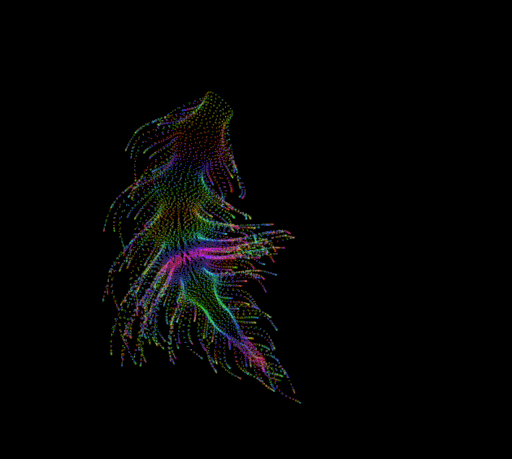

# The Binding Problem Animation

A single-page HTML/JavaScript implementation of the mathematical "creature" originally defined in Mathematica, illustrating the binding problem in cognitive neuroscience and philosophy. Original math and processing code are by artist @yuruyurau on 𝕏 -- check him out. Wolfram code https://community.wolfram.com/groups/-/m/t/3516580


## Quick view

Display in browser : [https://l0d0v1c.github.io/Creature/](https://l0d0v1c.github.io/Creature/)




---

## Table of Contents

- [Original Mathematica Code](#original-mathematica-code)
- [HTML/JavaScript Implementation](#htmljavascript-implementation)
- [Explanation](#explanation)

---

## Original Mathematica Code

```mathematica
Manipulate[
  Module[{pts},
    pts = Table[
      Module[{x, y, k, e, d, q, c, xp, yp},
        x = i;
        y = i/235.;
        k = (4 + Sin[x/11 + 8*t]) * Cos[x/14];
        e = y/8 - 19;
        d = Sqrt[k^2 + e^2] + Sin[y/9 + 2*t];
        q = 2*Sin[2*k] + Sin[y/17]*k*(9 + 2*Sin[y - 3*d]);
        c = d^2/49 - t;
        xp = q + 50*Cos[c] + 200;
        yp = q*Sin[c] + d*39 - 440;
        {xp, 400 - yp}
      ],
      {i, 9999, 0, -1}
    ];
    Graphics[
      {White, Opacity[.9], PointSize[.002], Point[pts]},
      PlotRange -> {{70, 330}, {30, 350}},
      Background -> GrayLevel[9/255],
      Axes -> False,
      ImageSize -> 550
    ]
  ],
  {t, 0, 2*Pi, Appearance -> "Labeled"}
]
```

---

## HTML/JavaScript Implementation

```html
<!DOCTYPE html>
<html lang="en">
<head>
  <meta charset="UTF-8">
  <title>The Binding Problem</title>
  <style>
    body {
      margin: 0;
      background: #090909;
      display: flex;
      align-items: center;
      justify-content: center;
      height: 100vh;
    }
    canvas {
      width: 550px;
      height: 678px;
      background: transparent;
    }
  </style>
</head>
<body>
  <canvas id="canvas" width="550" height="678"></canvas>

  <script>
    const canvas = document.getElementById('canvas');
    const ctx = canvas.getContext('2d');
    const W = canvas.width;
    const H = canvas.height;

    // PlotRange mapping
    const xMin = 70, xMax = 330;
    const yMin = 30, yMax = 350;
    const xScale = W / (xMax - xMin);
    const yScale = H / (yMax - yMin);

    let t = 0;

    function drawFrame() {
      ctx.clearRect(0, 0, W, H);
      ctx.fillStyle = 'rgba(255,255,255,0.9)';

      for (let i = 9999; i >= 0; i--) {
        const x = i;
        const y = i / 235;
        const k = (4 + Math.sin(x / 11 + 8 * t)) * Math.cos(x / 14);
        const e = y / 8 - 19;
        const d = Math.hypot(k, e) + Math.sin(y / 9 + 2 * t);
        const q = 2 * Math.sin(2 * k)
                + Math.sin(y / 17) * k * (9 + 2 * Math.sin(y - 3 * d));
        const c = d * d / 49 - t;
        const xp = q + 50 * Math.cos(c) + 200;
        const yp = q * Math.sin(c) + d * 39 - 440;
        const yPrime = 400 - yp;

        const px = (xp - xMin) * xScale;
        const py = H - (yPrime - yMin) * yScale;

        ctx.fillRect(px, py, 1, 1);
      }
    }

    function animate() {
      drawFrame();
      t += 0.02;
      if (t > Math.PI * 2) t -= Math.PI * 2;
      requestAnimationFrame(animate);
    }

    animate();
  </script>
</body>
</html>
```

---

## Explanation

1. **Canvas Setup**: We use a `<canvas>` element sized 550×678 pixels to match the original Mathematica `ImageSize` and maintain the aspect ratio of the specified `PlotRange`.

2. **Coordinate Mapping**:

   - `xMin`, `xMax`, `yMin`, and `yMax` correspond to Mathematica's `PlotRange -> {{70,330},{30,350}}`.
   - `xScale` and `yScale` transform mathematical coordinates into pixel positions on the canvas.

3. **Point Generation**:

   - A loop over `i` from 9999 down to 0 replicates Mathematica's `Table`.
   - Intermediate variables (`x, y, k, e, d, q, c, xp, yp`) are computed exactly as in Mathematica.

4. **Drawing**:

   - Points are drawn via `ctx.fillRect(px, py, 1, 1)`.
   - Color and opacity (`rgba(255,255,255,0.9)`) match Mathematica’s `White`, `Opacity[.9]`, and `PointSize[.002]`.

5. **Animation Loop**:

   - `requestAnimationFrame` runs the draw-update loop at \~60fps.
   - The time variable `t` increments by 0.02 per frame and wraps around at `2π`.

> *This single-page implementation preserves the mathematical structure and visual style of the original Mathematica code using standard web technologies.*

